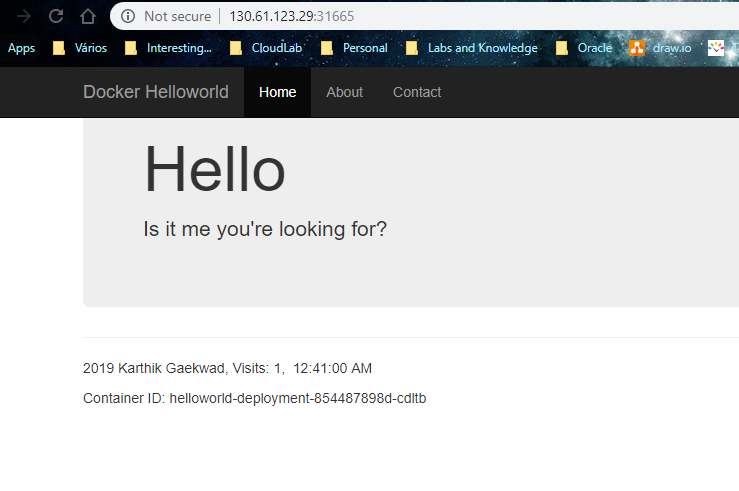

# Lab 000 - Kubernetes Basic Concepts 

- In this 1st part we will explore a few k8's basic concepts while on the same time preparing the environmnent we are going to work with.


### **Step 1**: Copy kubeconfig file 

It typically takes  around 5 minutes to create a managed OKE cluster in OCI, whether with the OCI Console, the OCI API, with Terraform or JenkinsX.

Today, you won't need to create a cluster as you're going to work in a cluster which was already created for you. All you'll have to do is to download the kubconfig file [here](https://objectstorage.eu-frankfurt-1.oraclecloud.com/n/interactivetech/b/kubeconfig_jotb2019/o/kubeconfig).

This file gives you a lot of power! You'll be able to execute any type of action or operation against the cluster! You'll need that power along this workshop!

### Now create a folder called container-workshop in your user area:
     
      $ mkdir -p $HOME/container-workshop
    
  ####    or
     
      $mkdir container-workshop
	     
	
####  You should have something like : 
        ```	
	 yourusername/container-workshop
        ```

Please, don't forget to copy the **kubeconfig** file you just downloaded into the **container-workshop** folder.

This folder will be your local working folder where you'll generally execute your commands and copy and download the different files you will need.

### **STEP 2**: Install and Test kubectl on Your Local Machine

- The method you choose to install `kubectl` will depend on your operating system and any package managers that you may already use. The generic method of installation, downloading the binary file using `curl`, is given below (**run the appropriate command in a terminal or command prompt**). If you prefer to use a package manager such as apt-get, yum, homebrew, chocolatey, etc, please find the specific command in the [Kubernetes Documentation](https://kubernetes.io/docs/tasks/tools/install-kubectl/).


  **Windows**
    ```bash
    cd %USERPROFILE%\container-workshop
    curl -LO https://storage.googleapis.com/kubernetes-release/release/v1.11.2/bin/windows/amd64/kubectl.exe
    ```

  **Mac**
    ```bash
    cd ~/container-workshop
    curl -LO https://storage.googleapis.com/kubernetes-release/release/$(curl -s https://storage.googleapis.com/kubernetes-release/release/stable.txt)/bin/darwin/amd64/kubectl
    chmod +x ./kubectl
    ```

  **Linux**
    ```bash
    cd ~/container-workshop
    curl -LO https://storage.googleapis.com/kubernetes-release/release/$(curl -s https://storage.googleapis.com/kubernetes-release/release/stable.txt)/bin/linux/amd64/kubectl
    chmod +x ./kubectl
    ```

- In your terminal window or command prompt, run the following commands to verify that `kubectl` is able to communicate with your cluster. You should see `cluster-info` print out the URL of the Kubernetes Master node and `get nodes` print out the IP address and status of each of the worker nodes.

  **Windows**
    ```bash
    set KUBECONFIG=%USERPROFILE%\container-workshop\kubeconfig
    echo %KUBECONFIG%
    kubectl.exe cluster-info
    kubectl.exe get nodes
    ```

  **Mac/Linux**
    ```bash
    export KUBECONFIG=~/container-workshop/kubeconfig
    ./kubectl cluster-info
    ./kubectl get nodes
    ```

    

    

    **NOTE**: You should see in the `cluster-info` that the Kubernetes master has an `oraclecloud.com` URL. If it instead has a `localhost` URL, your `KUBECONFIG` environment variable may not be set correctly. Double check the environment variable against the path and filename of your `kubeconfig` file.

If everything is ok, we can now use `kubectl` to start a proxy that will give us access to the Kubernetes Dashboard through a web browser at a localhost URL. Run the following command in the same terminal window:

  **Windows**
    ```bash
    kubectl.exe proxy
    ```

  **Mac/Linux**
    ```bash
    ./kubectl proxy
    ```

  

  **NOTE**: If you receive an error stating `bind: address already in use`, you may have another application running on port 8001. You can specify a different port for the proxy by passing the `--port=` parameter, for example `kubectl proxy --port=8002`. Note that you  will have to modify the URL for the dashboard in the next step to match this port.

- Leave the proxy server running and navigate to the [Kubernetes Dashboard by Right Clicking on this link](http://localhost:8001/api/v1/namespaces/kube-system/services/https:kubernetes-dashboard:/proxy/), and choosing **open in a new browser tab**.

- You are asked to authenticate to view the dashboard. Click **Choose kubeconfig file** and select your `kubeconfig` file from the folder `~/container-workshop/kubeconfig`. Click **Open**, then click **Sign In**.

  

- After authenticating, you are presented with the Kubernetes dashboard.

  

- Great! We've got Kubernetes installed and accessible -- now we're ready to get our services deployed to the cluster. In your **terminal window**, press **Control-C** to terminate `kubectl proxy`. We will need the terminal window to gather some cluster info in another step. We'll start the proxy again later. Great job!

### **Step 3**: Create your namespace

  **Check the existing namespaces in the cluster**
    
    $ kubectl get namespaces --show-labels
   
   **Now lets create our own namespace where we are going to work**
   
   In a text editor create a local file called namespace.json or just download [this](https://objectstorage.eu-frankfurt-1.oraclecloud.com/n/interactivetech/b/kubeconfig_jotb2019/o/namespace-dev.json) template and change it accordingly
   
   
   
      {
	  "kind": "Namespace",
	  "apiVersion": "v1",
	  "metadata": {
	    "name": "fernando-harris",
	    "labels": {
	      "name": "fernando-harris"
	    }
	  }
	}
    
where you see my name-surname, please replace with yours and thats shall become your namespace. If it colides with one of your coleagues namespace, please use one of your other surnames, or nicknames.... I'm sure you have many cool nicknames :p !
   
  **Run the following command to create the namespace **
   
   	$ kubectl create -f namespace-dev.json
	
  **If you check the existing namespacesd again, you should see more stuff created **
   
   	$ kubectl get namespaces --show-labels

And your namespace should be part of this list of recently created namespaces in the cluster

### **Step 4**: Prepare to work in the correct context

We are going to work each one with our own set of resources inside our namespace.
To make sure we don't mess around wit our coleagues namespaces, nor with the default namespace, we are going to create a specific context associated with your namespace. This will help us assuring that every kubectl execution we run on our laptop, will be against our personal namespace!
	
Copy the following line and past it into a text editor:

	$ kubectl config set-context nameofyourcontext --namespace=urnamespace --cluster=cluster-csdonbzmu2d --user=user-csdonbzmu2d

Replace ****nameofyourcontext**** with the same value you've used for your namespace in the above point!
	
Well ****urnamespace**** is supposed to be replaced with your namespace !!! Yes you guessed it right! 

If you get a message ****Context "nameofyourcontext" created.**** then it should be ok!
	
 **Now let's use the context we've created**
   
   	$ kubectl config use-context nameofyourcontext
	
If you get a message ****Swtiched to contex "nameofyourcontext".**** then it should be ok!
	
   **Just check it again to make sure...**
   
   	$ kubectl config current-context


### **Step 5**: Deploy your first image to OKE

**Let's create the deployment in the cluster**

Please download the manifest yaml for the deployment definition from [here](https://objectstorage.eu-frankfurt-1.oraclecloud.com/n/interactivetech/b/kubeconfig_jotb2019/o/manifestDeployment.yml).

	$ kubectl create -f manifestDeployment.yml

You should get a message saying that a deployment was created.

**Check deployment**
	
	$ kubectl get deployments

**Checking the pods created**

	$ kubectl get pods
	
	$ kubectl describe pods yourpodname
	
 Take note of the IP of the node where your pod was deployed:
 
 
   
   
   
   
   

**Let's create the service in the cluster**

Please download the manifest yaml for the service definition from [here](https://objectstorage.eu-frankfurt-1.oraclecloud.com/n/interactivetech/b/kubeconfig_jotb2019/o/manifestService.yml).

	$ kubectl create -f manifestService.yml
	
You should get a message saying that your service was created.

**Let's take a look....**
	
	$ kubectl get services

Take note of the port where your service was configured


**Test your deployement**

Open your browser and navigate to the IP you took note and the port you've also took note:





### Congratulations! You finished the first part of the workshop!

- You may proceed to [Lab 100](LabGuide100.md) and start the second part of the workshop where you'll setup a CI / CD with Container Pipelines aka Wercker!


