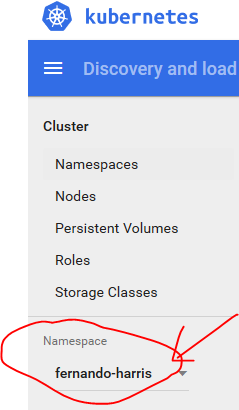
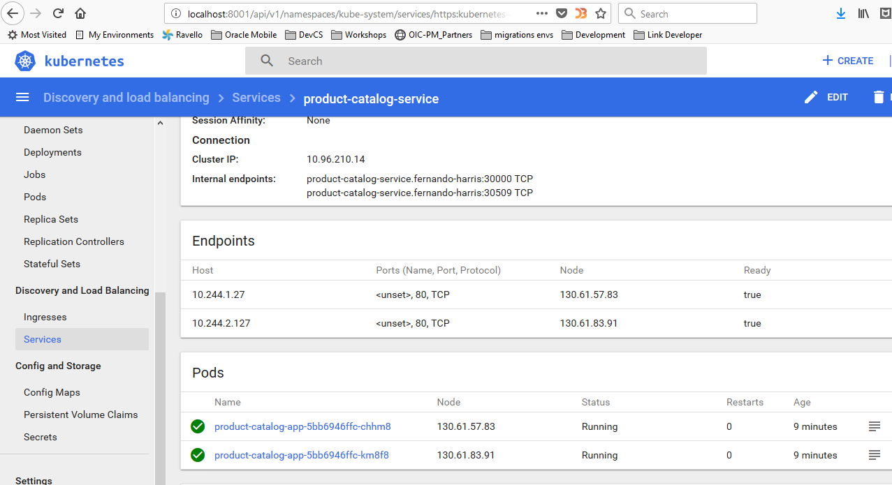
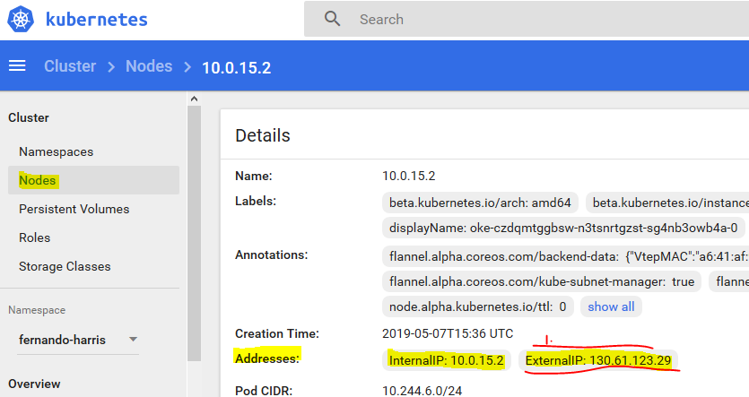

# Lab 200 - Automate Deployment to Kubernetes


## Introduction

In the previous lab you pushed the image of your twitter-feed microservice to your docker repository. Now its time to use that image and automate its deployment against your namespace inside our kubernetes cluster.

## Objectives

**Automate Deployment to Kubernetes**

- Deploy to a Kubernetes Cluster
  - Configure and Run Wercker Deployment Pipelines
  - Deploy and Test the Product Catalog Application

## Configure and Run Wercker Deployment Pipelines

### **STEP 6**: Define Kubernetes Deployment Specification

- From a browser, navigate to your forked twitter-feed repository on GitHub. If you've closed the tab, you can get back by going to [GitHub](https://github.com/), scrolling down until you see the **Your repositories** box on the right side of the page, and clicking the **twitter-feed** link.

  

- Click **Create new file**

  

- In the **Name your file** input field, enter `kubernetes.yml.template`

  

- **Copy** the YAML below and **paste** it into the file editor.

  >This configuration consists of two parts. The first section (up to line 28) defines a **Deployment**, which tells Kubernetes about the application we want to deploy. In this Deployment we instruct Kubernetes to create two Pods (`replicas: 2`) that will run our application. Within those pods, we specify that we want one Docker container to be run, and compose the link to the image for that container using environment variables specific to this workflow execution (`image: ${DOCKER_REPO}:${WERCKER_GIT_BRANCH}-${WERCKER_GIT_COMMIT}`).

  >The second part of the file defines a **Service**. A Service defines how Kubernetes should expose our application to traffic from outside the cluster. In this case, we are asking for a cluster-internal IP address to be assigned (`type: ClusterIP`). This means that our twitter feed will only be accessible from inside the cluster. This is ok, because the twitter feed will be consumed by the product catalog application that we will deploy later. We can still verify that our twitter feed is deployed properly -- we'll see how in a later step.

  >A `.yml` file is a common format for storing Kubernetes configuration data. The `.template` suffix in this file, however, is not a Kubernetes concept. We will use a Wercker step called **bash-template** to process any `.template` files in our project by substituting environment variables into the template wherever `${variables}` appear. You'll add that command to a new pipeline in the next step.

```yaml
apiVersion: extensions/v1beta1
kind: Deployment
metadata:
  name: twitter-feed-v1
  labels:
    commit: ${WERCKER_GIT_COMMIT}
spec:
  replicas: 2
  selector:
    matchLabels:
      app: twitter-feed
  template:
    metadata:
      labels:
        app: twitter-feed
        commit: ${WERCKER_GIT_COMMIT}
    spec:
      containers:
      - name: twitter-feed
        image: ${DOCKER_REPO}:${WERCKER_GIT_BRANCH}-${WERCKER_GIT_COMMIT}
        imagePullPolicy: Always
        ports:
        - name: twitter-feed
          containerPort: ${PORT}
          protocol: TCP
      imagePullSecrets:
        - name: wercker
---
apiVersion: v1
kind: Service
metadata:
  name: twitter-feed
  labels:
    app: twitter-feed
    commit: ${WERCKER_GIT_COMMIT}
spec:
  ports:
  - port: 30000
    targetPort: ${PORT}
  selector:
    app: twitter-feed
  type: ClusterIP
---
```

- At the bottom of the page, click **Commit new file**

  

- Since you've committed to the repository, Wercker will trigger another execution of your workflow. We haven't defined the deployment pipelines yet, so this will just result in a new entry in Wercker's Runs tab and a new image pushed to the container registry. You don't need to do anything with those; you can move on to the next step.

### **STEP 7**: Define Wercker Deployment Pipelines

- Click the file **wercker.yml** and then click the **pencil** button to begin editing the file.

  

- **Copy** the YAML below and **paste** it below the pipelines we defined earlier.

  >This will define a new **Pipeline** called deploy-to-cluster. The pipeline will make use of a new type of step: **kubectl**. If you have used Kubernetes before, you will be familiar with kubectl, the standard command line interface for managing Kubernetes. The kubectl Wercker step can be used to execute Kubernetes commands from within a Pipeline.

  >The **deploy-to-cluster** Pipeline will prepare our kubernetes.yml file by filling in some environment variables. It will then use kubectl to tell Kubernetes to apply that configuration to our cluster.

```yaml
 
#Deploy our container from the Docker Hub to Kubernetes
deploy-to-cluster:
    box:
        id: alpine
        cmd: /bin/sh
    steps:

    - bash-template

    - script:
        name: "Visualise Kubernetes config"
        code: cat kubernetes.yml
    
    
    - kubectl:
        name: set context
        server: $KUBERNETES_MASTER
        #username: $KUBERNETES_USERNAME
        token: $KUBERNETES_TOKEN
        insecure-skip-tls-verify: true
        command: config set-context $KUBERNETES_CONTEXT --namespace=$KUBERNETES_NAMESPACE --cluster=$KUBERNETES_CLUSTER_ID --user=$KUBERNETES_CLUSTER_USER

    - kubectl:
        name: use context
        server: $KUBERNETES_MASTER
        #username: $KUBERNETES_USERNAME
        token: $KUBERNETES_TOKEN
        insecure-skip-tls-verify: true
        command: config use-context $KUBERNETES_CONTEXT

    - kubectl:
        name: deploy to kubernetes
        server: $KUBERNETES_MASTER
        #username: $KUBERNETES_USERNAME
        token: $KUBERNETES_TOKEN
        insecure-skip-tls-verify: true
        command: apply -f kubernetes.yml

```

- At the bottom of the page, click **Commit changes**.

  

- Since you've committed to the repository again, Wercker will once again trigger an execution of your workflow. We still haven't configured the deployment pipelines in Wercker yet, so we'll still end up with a new Run and a new image, but not a deployment to Kubernetes.

### **STEP 8**: Set up deployment pipelines in Wercker

- Open **[Wercker](https://app.wercker.com)** in a new tab or browser window, or switch to it if you already have it open. In the top navigation bar, click **Pipelines**, then click on your **twitter-feed** application.

  

- On the **Runs** tab you can see that Wercker has triggered another execution of our build and publish workflow, but it has not executed our new deploy-to-cluster pipeline. This is because we have not added the new pipeline to the workflow definition yet. Let's do that now -- click on the **Workflows** tab, then click the **Add new pipeline** button.

  

- Enter `deploy-to-cluster` into both the Name and YML Pipleine name fields. Click **Create**.

  

- Click the **Workflows** tab again to get back to the editor.

- Click the **plus** button to the right of the **push-release** pipeline to add to the workflow. In the **Execute Pipeline** drop down list, select **deploy-to-cluster** and click **Add**

  

- Your overall Workflow should now have three Pipelines:

  

- Now we've got our workflow updated with our deployment pipelines, but there's one more thing we need to do before we can actually deploy. We need to set two environment variables that tell Wercker the address of our Kubernetes master and provide an authentication token for Wercker to issue commands to Kubernetes.

### **STEP 9**: Set up environment variables in Wercker

- As you noticed from the step **deploy-to-cluster** defined above in the yaml, there are a few environment variables related to our kubernetes cluster to be created.

Open the file **kubeconfig** and copy the values accordingly:


```
  Key:                      Value:                                                           Protected:
  KUBERNETES_NAMESPACE      namespace created in previous exercise e.g: fernando-harris      no
  KUBERNETES_CONTEXT        used the same as for namespace e.g.: fernando-harris             no
  KUBERNETES_TOKEN          copy value token from kubeconfig file                            yes  
  KUBERNETES_MASTER         copy value server from kubeconfig file                           yes
  KUBERNETES_CLUSTER_ID     copy value cluster from kubeconfig file                          yes
  KUBERNETES_CLUSTER_USER   copy value user from kubeconfig file                             yes
```
:

- So, for example, for the **KUBERNETES_TOKEN**, back in your Wercker browser tab, click the **Environment** tab. In the key field of the empty row below the last environment variable, enter the key **KUBERNETES_TOKEN**. In the value field, **paste** the token we just copied. Check the **Protected** box and click **Add**. _NOTE:_ when you paste into the environment field, ensure that you _remove any Line Feed character_ that might be included.

  


- Now, for the new environment variable with the key **KUBERNETES_MASTER**  you should find in the **kubeconfig** file something as this:
  

Create the rest of the environment variables following these 2 examples and the table above!

- Now we're ready to try out our workflow from start to finish. We could do that by making another commit on GitHub, since Wercker is monitoring our source code. We can also trigger a workflow execution right from Wercker. We'll see how in the next step.

### **STEP 10**: Trigger a retry of the pipeline

- On your Wercker application page in your browser, click the **Runs** tab. Your most recent run should have successful build and push-release pipelines. Click the **push-release** pipeline.

  

- From the **Actions** menu, click **deploy-to-cluster**.

  

- In the dialog box that appears, click **Execute pipeline**

  

- Click the **Runs** tab so you can monitor the execution of the pipeline. Within a minute or so, the deployment pipeline should complete successfully. Now we can use the Kubernetes dashboard to inspect and validate our deployment.

  

### **STEP 11**: Validate deployment

- In a terminal window, start the **kubectl proxy** using the following command. Your `KUBECONFIG` environment variable should still be set from a previous step. If not, reset it.

  ```bash
  kubectl proxy
  ```

- In a browser tab, navigate to the [**Kubernetes dashboard**](http://localhost:8001/api/v1/namespaces/kube-system/services/https:kubernetes-dashboard:/proxy/#!/login) and don't forget that if you're already using port 8001 you should run:


  ```bash
  kubectl proxy -p 9006
  ```

where **9006** is the port where you want to run the kubernetes dasboard in this example. In this case, please replace in the link the value **8001** by **9006** in order to get access to the **Kubernetes Dashboard**:

- First thing to do is to select your  "Namespace" in the right side section.

Please, keep this in mind for this training that when working in the **Kubernetes dashboard**, make sure you're working in your namespace and not in the default namespace, or in one of your buddies nampespace:

  


- Click on the **Overview** menu option in the Kubernetes dashboard **left-hand menu**. In the pods section, you should see two twitter-feed pods running. Click the **name of one of the pods** to go to the detail page.

  

- On the pod detail page, in the top menu bar, click **Exec**. This will give us a remote shell on the pod where we can verify that our application is up and running.

  

- In the shell that is displayed, **paste** the following command and press **Enter**.

  **NOTE:** You may need to use **ctrl-shift-v** to paste, but if running in a Virtual Box image, you will need to type the command.

  `curl -s http://$HOSTNAME:8080/statictweets | head -c 100`

- You should be able to see the first 100 characters of the JSON data being returned by our twitter feed service. Our microservice has been deployed successfully! But the twitter feed service is just one part of our product catalog application. Let's deploy the rest of the application so we can validate that everything works together as expected. Leave this browser tab open, as we will use it in a later step.

  

**NOTE**: You may be wondering why we had to use the Kubernetes remote terminal to test our application. Remember the kubernetes.yml file that we created earlier -- we specified a cluster-internal IP address for our twitter-feed service. This means that only other processes inside the cluster can reach our service. If we wanted to access our service from the internet, we could have used a load balancer instead.

## Deploy and Test the Product Catalog Application

### **STEP 12**: Download the Product Catalog Kubernetes YAML file

- From a browser, navigate to your forked twitter-feed repository on GitHub. If you've closed the tab, you can get back by going to [GitHub](https://github.com/), scrolling down until you see the **Your repositories** box on the right side of the page, and clicking the **twitter-feed** link.

  

- Click on the **alpha-office-product-catalog.kubernetes.yml** file.

  

- **Right click** on the **Raw** button and choose **Save Link As**. In the save file dialog box that appears, note the location of the file and click **Save**

  

**NOTE**: This YAML file contains the configuration for a Kubernetes deployment and service, much like the configuration for our twitter feed microservice. In a normal development environment, the product catalog application would be managed by Wercker as well, so that builds and deploys would be automated. In this workshop, however, you will perform a one-off deployment of a pre-built Docker image containing the product catalog application from within the Kubernetes dashboard.

### **STEP 13**: Deploy and test the Product Catalog using the Kubernetes dashboard

- Switch back to your  [**Kubernetes dashboard**](http://localhost:8001/api/v1/namespaces/kube-system/services/https:kubernetes-dashboard:/proxy/#!/login)

Please, when working in the **Kubernetes dashboard**, make sure you're working in your namespace and not in the default namespace, or in one of your buddies nampespace.

  


- In the upper right corner of the dashboard, click **Create**.

  

- Click the **Upload a YAML or JSON file** radio button, then click the **three dots** button to browse for your file. In the dialog, select the YAML file you just downloaded from GitHub and click **Open**, then click **UPLOAD**.

  

  **NOTE:** You could alternatively deploy this application using the command line interface, with `kubectl apply -f ~/Downloads/alpha-office-product-catalog.kubernetes.yml`

- In the left side navigation menu, click **Overview**. You should see two new product-catalog-app pods being created and soon change state to Running.

  

- Instead of a cluster-internal IP address, the product-catalog-service will be exposed to the internet via a **Node Port**. The node where our pod is running will expose a port for this service on its public IP address.  All the information you need to have access to the application can be obtained as well in the  **Kubernetes dashboard** browser tab. 
Make sure you're in your namespace. Then go to **Discovering and Load Balancing --> Services --> product-catalog-service** .


Follow the image below and take note of the node port which is exposed through a **service**. According to the image below would be **32318** , and take note of theinternal names of the nodes where the deployment ocurred just as you did in lab 000 before. In this case, as 2 replicas were deployed, 2 pods are running. one in the node **10.0.15.2** and another in the node **10.0.13.2**. 


 	
Now, if you go to **Cluster-->Nodes-->NodeName(eg:10.0.15.2)** you should be able to see the image below where you can associate the node to an **external IP**. An **external IP** in our cluster always has the format **130.61.X.X**. In the image below what would be **130.61.123.29** :



Okidoki, now if you go to a browser and try http://130.61.123.29:32318/  ....

- You should see the product catalog site load successfully, validating that our new Kubernetes deployment and service were created correctly. Let's test the twitter feed functionality of the catalog. Click the first product, **Crayola New Markers**. The product's twitter feed should be displayed.

  

  **NOTE**: You may have noticed that we did not need to alter the pre-built product catalog container with the URLs of the twitter feed pods or service. The product catalog app makes use of Kubernetes DNS to resolve the service name (twitter-feed) into its IP address. Kubernetes DNS assigns a DNS name to every service defined in your cluster, so any service can be looked up by doing a DNS query for the name of the service (prefixed by _`namespace.`_ if the service is in a different namespace from the requester). The product catalog server uses the following JavaScript code to make an HTTP request to the twitter feed microservice:`request('http://twitter-feed:30000/statictweets/color', function (error, response, body) { ... });`

- Some tweets are indeed displayed, but they aren't relevant to this product. It looks like there is a bug in our twitter feed microservice! Continue on to the next lab to explore how to make bug fixes and updates to our microservice.

**You are now ready to move to the next lab, [Lab 300](LabGuide300.md)**
